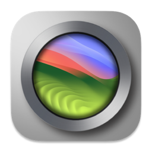
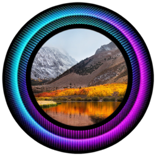
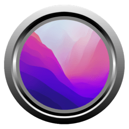
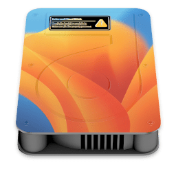
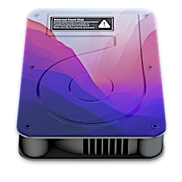
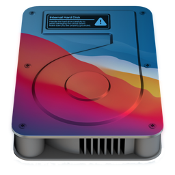
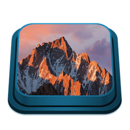
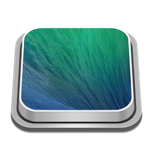

See some Icon Set to Download|
:----|

- View Themes Icons ➤ [Flavours-Titanium](https://github.com/chris1111/My-Simple-OC-Themes/tree/master/SSD_Icons/Flavours-Titanium)

- View Themes Icons ➤ [Flavours-BlackWhite](https://github.com/chris1111/My-Simple-OC-Themes/tree/master/SSD_Icons/BlackWhite)

- View Themes Icons ➤ [Flavours-Dev](https://github.com/chris1111/My-Simple-OC-Themes/tree/master/SSD_Icons/Flavours-Dev)

- View Themes Icons ➤ [Flavours-Ring](https://github.com/chris1111/My-Simple-OC-Themes/tree/master/SSD_Icons/Flavours-Ring)

- View Themes Icons ➤ [Flavours-IOSWhite](https://github.com/chris1111/My-Simple-OC-Themes/tree/master/SSD_Icons/Flavours-IOSWhite)

- View Themes Icons ➤ [Flavours-BlueC](https://github.com/chris1111/My-Simple-OC-Themes/tree/master/SSD_Icons/Flavours-BlueC)

- View Themes Icons ➤ [Flavours-T](https://github.com/chris1111/My-Simple-OC-Themes/tree/master/SSD_Icons/Flavours-T)

- View Themes Icons ➤ [Flavours-CleanDark](https://github.com/chris1111/My-Simple-OC-Themes/tree/master/SSD_Icons/Flavours-CleanDark)
 

- View Themes Icons ➤ [Flavours-Mountain](https://github.com/chris1111/My-Simple-OC-Themes/tree/master/SSD_Icons/Flavours-Mountain)

- View Themes Icons ➤ [Flavours-Frame Themes Icons](https://github.com/chris1111/My-Simple-OC-Themes/tree/master/SSD_Icons/Flavours-Frame)

- View Themes Icons ➤ [Flavours Themes Disk Icons](https://github.com/chris1111/My-Simple-OC-Themes/tree/master/SSD_Icons/Flavours-DiskIcons)

- View Themes Icons ➤ [Flavours-DarkSide Themes Icons](https://github.com/chris1111/My-Simple-OC-Themes/tree/master/SSD_Icons/Flavours-DarkSide)

- View Themes Icons ➤ [Flavours-D Themes Icons](https://github.com/chris1111/My-Simple-OC-Themes/tree/master/SSD_Icons/Flavours-D)

- View Themes Icons ➤ [Flavours-Blue Themes Icons](https://github.com/chris1111/My-Simple-OC-Themes/tree/master/SSD_Icons/Flavours-Blue)

- View Themes Icons ➤ [Flavours-Design Themes Icons](https://github.com/chris1111/My-Simple-OC-Themes/tree/master/SSD_Icons/Flavours-Design)

- View Themes Icons ➤ [Flavours-MacSystem Themes Icons](https://github.com/chris1111/My-Simple-OC-Themes/tree/master/SSD_Icons/Flavours-MacSystem)

- View Themes Icons ➤ [Flavours-Border Themes Icons](https://github.com/chris1111/My-Simple-OC-Themes/tree/master/SSD_Icons/Flavours-Border)

- View Themes Icons ➤ [Flavours-Mac Themes Icons](https://github.com/chris1111/My-Simple-OC-Themes/tree/master/SSD_Icons/Flavours-Mac)

- View Themes Icons ➤ [Flavours-Icon Themes](https://github.com/chris1111/My-Simple-OC-Themes/tree/master/SSD_Icons/Flavours-Icons)

- View Theme Icons ➤ [Flavours-Metallic Themes Icons](https://github.com/chris1111/My-Simple-OC-Themes/tree/master/SSD_Icons/Flavours-Metallic-Icons)

- View Theme Icons ➤ [Flavours-Dark Themes Icons](https://github.com/chris1111/My-Simple-OC-Themes/tree/master/SSD_Icons/Flavours-Dark)

[Back on top ↑](https://github.com/chris1111/My-Simple-OC-Themes/blob/master/Icon%20Set.md)
